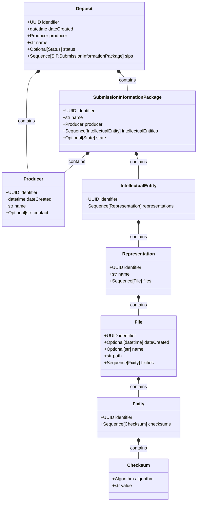

# Data Archive Models

A collection of JSON schemas defining data models for digital archiving systems based on the OAIS (Open Archival Information System) reference model. These schemas provide standardized definitions for various components of a data archive.

## Core Functionality

The project defines JSON schemas for key entities in a digital archiving workflow:

- **Producer**: Entity that provides data to be archived
- **Deposit**: Information about a submission to the archive
- **SIP (Submission Information Package)**: Package of information submitted to the archive
- **IntellectualEntity**: Conceptual object being preserved
- **Representation**: Digital manifestation of an intellectual entity
- **File**: Individual digital file within a representation
- **Fixity**: Integrity information for digital files

All schemas are currently at version 0.1.0, indicating this is an early-stage project.

> ### Project Status Notice
> This project is in **alpha** and actively evolving.
>
> - **Stability:** Bugs, breaking changes, or incomplete features may occur.
> - **Evolution:** APIs and behaviors can change as we refine functionality.
>
> Provided as‑is, with no guarantees on stability.
>
> We appreciate your patience and feedback!

## Setup/Installation

### Prerequisites

- Java 21
- Maven
- Python 3.12
- Nix with flakes enabled (recommended)
- direnv for environment management (recommended)

### Recommended Nix + Direnv Setup

We recommend using the fully automatic setup method using Nix Flakes and Direnv:

#### Prerequisites
- Nix package manager with flakes enabled
- direnv for environment management

#### Steps
1. Clone the repository
2. Allow direnv in the project directory:
   ```bash
   direnv allow
   ```

This will automatically:
- Create a Python 3.12 virtual environment in .venv
- Install all dependencies using UV package manager
- Set up the development environment

If you'd like to activate the environment manually without direnv:
```bash
nix develop
```

## Development Workflow

### Python Model Generation

Python models are automatically generated from JSON schemas:

```bash
# Generate Python models from JSON schemas
datamodel-codegen \
  --input-file-type jsonschema \
  --input schemas/data-archive/ \
  --output src/data_archive/ \
  --output-model-type pydantic_v2.BaseModel \
  --field-constraints \
  --use-schema-description
```

The generated models use Pydantic v2 and are stored in the `src/data_archive/` directory.

### Java Class Generation

Java classes are automatically generated from JSON schemas using the jsonschema2pojo Maven plugin:

```xml
<!-- Plugin configuration in pom.xml -->
<plugin>
    <groupId>org.jsonschema2pojo</groupId>
    <artifactId>jsonschema2pojo-maven-plugin</artifactId>
    <version>1.2.1</version>
    <configuration>
        <sourceDirectory>${project.basedir}/schemas/data-archive</sourceDirectory>
        <outputDirectory>${project.build.directory}/generated-sources/</outputDirectory>
        <targetPackage>ch.ethz.library.darc.model</targetPackage>
        <excludes>
            <exclude>_shared/**</exclude>
            <exclude>catalog.json</exclude>
        </excludes>
    </configuration>
</plugin>
```

The plugin is executed during the Maven `prepare-package` phase and generates Java classes from the JSON schemas in the `schemas/data-archive/` directory. The generated classes are stored in the `target/generated-sources/` directory under the package `ch.ethz.library.darc.model`.

To generate the Java classes, you can use one of the Maven commands listed in the [Java Build Options](#java-build-options) section.

### Dependency Management

The project uses `uv` for Python dependency management:

```bash
# Generate lock file
uv lock

# Install dependencies
uv sync

# Build Python package
uv build
```

### Java Build Options

The project provides several Maven build commands:

1. **Validate JSON schemas only**:
   ```bash
   mvn -Dtest=JsonSchemaValidationTest test
   ```

2. **Generate Java classes without validation** (skip tests):
   ```bash
   mvn prepare-package -DskipTests
   ```

3. **Standard build** (validate schemas then generate classes):
   ```bash
   mvn package
   ```

## Data Model

### Class Diagram

The following class diagram visualizes the relationships between the different entities in the data archive model. The diagram is automatically generated from the Pydantic models in the codebase.

<!-- BEGIN_MERMAID_DIAGRAM -->

<!-- END_MERMAID_DIAGRAM -->

### Generating the Diagram

The class diagram is generated using Python scripts located in the `scripts` directory:

- `scripts/generate_mermaid_diagram.py`: Generates a Mermaid class diagram from Pydantic models in the data_archive package
- `scripts/update_readme.py`: Updates this README.md file with the generated diagram

To update the diagram:

```bash
python scripts/update_readme.py
```

This will:
1. Scan the Pydantic models in the `src/data_archive` directory
2. Generate a Mermaid class diagram
3. Update the diagram in this README.md file between the marker comments

## Continuous Integration

The project uses GitHub Actions for CI. The workflow automatically:
- Sets up the Nix environment shell
- Implements Maven dependency caching for all jobs
- Runs schema validation tests
- Generates Java classes from JSON schemas
- Generates Python models from JSON schemas
- Publishes Java artifacts to GitHub Packages
- Publishes Python packages to TestPyPI
